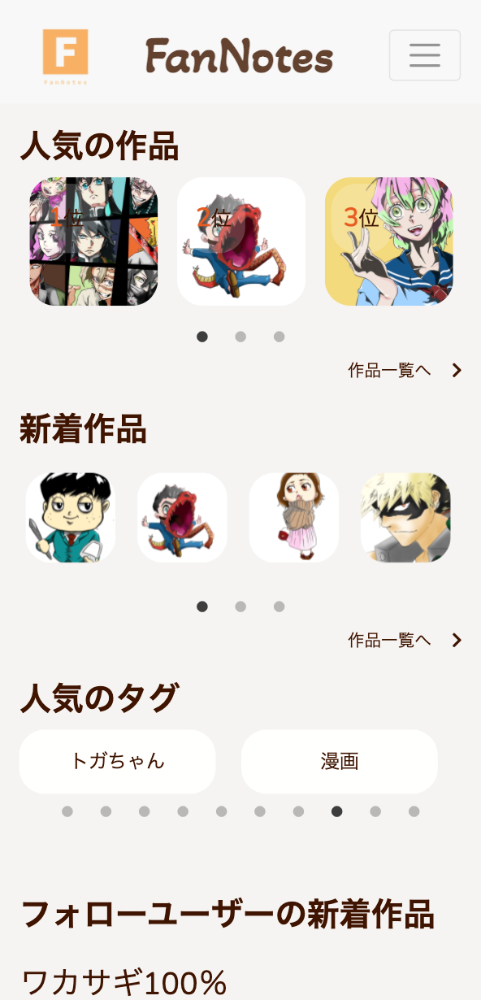
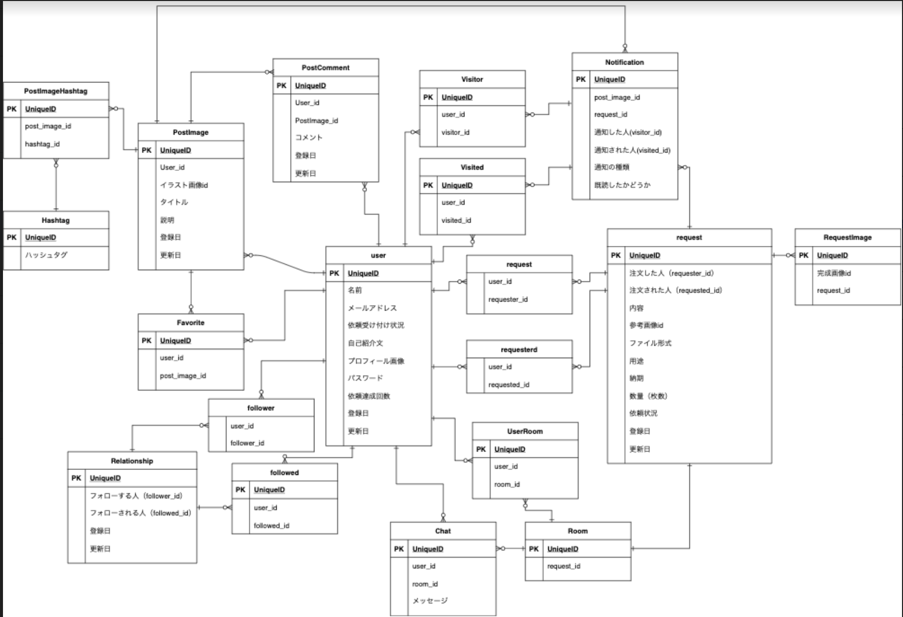

# FanNotes

## サイト概要

自分で描いたイラストを投稿、閲覧するサイトです。  
自分の好きなイラストを描く人を見つけて、オリジナルキャラクターやアイコン、HPの素材の作成依頼が可能です。 
またスマートフォン表示にも対応しています。 
 
 
トップ画面(PC)

メイン画面(SP)

### サイトテーマ
自分の好きなイラストを描く人に出会いもっと手軽で簡単に似顔絵や、オリジナルイラストの制作を依頼しよう！ 

### テーマを選んだ理由
実際に趣味でイラストを描いているのですが、インスタグラムのメッセージでこんな絵を描いて欲しいと依頼がきたことがありました。 
その時に、自分の絵を投稿できて、その絵を見てくれた人が手軽にイラストなどを描いて欲しいと依頼できるようなサービスはあまりないなと感じ、pixivとcoconalaが一緒になったようなサービスがあれば、便利だなと思いこのテーマを作成しました。 
※昨年10月ごろにpixivにもリクエスト機能が追加されました。

### ターゲットユーザー
イラストが好きで実際に自分のアイコンなどを描いて欲しいやHPなどでの独自のイラストが欲しいユーザー  
自分の絵を宣伝してもらうことで、自分の知名度を上げたいと考えているイラストを描いているユーザー

### 主な利用シーン
自分のアイコンを作成してもらいたいときや、オリジナルのキャラクターの作成、HPの素材などの作成の為使用 
自分のイラストや絵、アイコンなどをたくさんの人と共有したい時に使用 
イラストが上手いのにあまり有名でないユーザーの宣伝目的での使用 

## URL

https://fannote.work/

ゲストログインからメールアドレス、アカウントネームなしでのログインが可能です。

## 設計書
- ER図

 

## 機能一覧
[機能要素一覧](https://docs.google.com/spreadsheets/d/1xGH92fN1MlcEEDbYz5IXmz-6vFFc0-o3LSYVyaYTkGo/edit#gid=0)
 
- ユーザー登録、ログイン機能(devise)
- 投稿機能(refile)
  - いいね機能（非同期通信）
  - コメント機能（非同期通信）
  - ハッシュタグ機能
- フォロー機能（非同期通信）
- 検索機能
  - ランキング機能
  - 並び替え機能
- イラスト依頼機能
  - チャット機能
  - プレビュー機能(jquery)
- 通知機能（非同期通信）
- ページネーション機能(kaminari)
- 日本語機能(rails-i18n)
- 環境変数(dotenv-rails)

## 使用追加gem
- repec(テスト)
  - factory_bot_rails(データの作成)
- devise(ログイン機能)
- dotenv-rails(環境変数)
- refile/redile-mini-magick(画像投稿)
- rails-in18s(日本語)
- kaminari(ページネーション)
- bullet(N+1)
- faker(サンプルデータ作成)
- pry-byebug(デバック)
- bootstrap(bootstrap使用)
- jquery-rails(jquery使用/slick)
- font-awesome-sass(fontawesome)

## 開発環境
- OS：Linux(CentOS)
- 言語：HTML,CSS,JavaScript,Ruby,SQL
- フレームワーク：Ruby on Rails ver.5.2.4
- JSライブラリ：jQuery(slick)
- デプロイ：AWS
- IDE：Cloud9

## 今後の開発予定
- 全体のテストの充実（現在は一部のテストのみの為）
- 外部アカウント認証機能（Google, Twitter）
- ユーザーの評価機能
- 依頼するユーザーによって金額が発生する仕様
- Vue.jsを使用したフロントエンドの開発 etc...

## 使用素材
- [hatchful(ロゴの制作)](https://hatchful.shopify.com/ja/onboarding/logo-usages)
- [Unsplash photo for everyone(画像の使用)](https://unsplash.com/)
- [unDraw(画像の使用)](https://undraw.co/)
- [fontawesome(アイコンの)](https://fontawesome.com/)